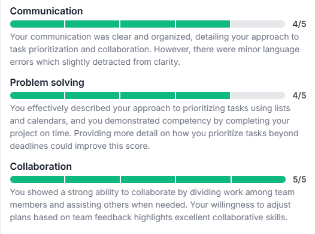

### Question: Can you provide an example of how you manage conflict?

**AI Feedback:**

**Answer (STAR):**
- S: During a university project, I had a conflict with a teammate.
- T: We needed to agree on how to divide the work and finish the project.
- A: I suggested a break, then we talked calmly, listened to each other, and combined our ideas into one plan.
- R: We agreed, divided the tasks based on our strengths, and completed the project successfully.

### Question: How do you prioritize tasks?

**AI Feedback:**

**Answer (STAR):**
- S: Last semester at university, I had a big project, other homework, and a part-time job.
- T: I had to manage my time and finish everything on time.
- A: Made a task list with deadlines & Used a calendar to focus on important tasks & Talked with team members to divide work.
- R: Project was finished on time & Learned how planning and collaboration help with organization and success.
