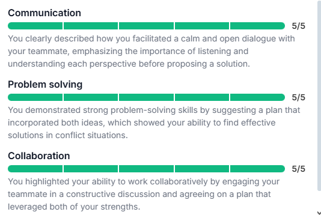
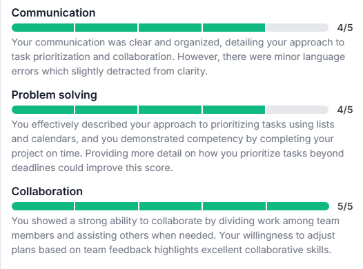

### Question: Can you provide an example of how you manage conflict?

**AI Feedback:**

**Answer (STAR):**
- S: During a university project, I had a conflict with a teammate.
- T: We needed to agree on how to divide the work and finish the project.
- A: I suggested a break, then we talked calmly, listened to each other, and combined our ideas into one plan.
- R: We agreed, divided the tasks based on our strengths, and completed the project successfully.

### Question: How do you prioritize tasks?

**AI Feedback:**

**Answer (STAR):**
- S: Last semester at university, I had a big project, other homework, and a part-time job.
- T: I had to manage my time and finish everything on time.
- A: Made a task list with deadlines & Used a calendar to focus on important tasks & Talked with team members to divide work.
- R: Project was finished on time & Learned how planning and collaboration help with organization and success.

## STAR responses for 5 common questions : 

### STAR Question 1 : Describe a situation where you had to learn a new technology quickly.

**Answer (STAR):** 
- S: I joined a mini internship where the team was using Git and GitHub, which I hadn’t used before
- T: I had to learn Git fast to keep up with the team
- A: I watched short tutorials, practiced branching and committing on my own repo, and asked my teammate to review my pull requests.
- R: By the second day, I was confident with Git and started contributing without issues.

### STAR Question 2 : Tell me about a time you received critical feedback. How did you respond?

**Answer (STAR):** 
- S: In a mock interview, the interviewer said my answers were too long and not structured.
- T: I had to improve my communication before the real interviews.
- A: I reviewed STAR format again, watched examples on Exponent, and practiced giving shorter, clearer answers.
- R: In the next mock, I got better feedback. I learned to stay on point and avoid overexplaining.

### STAR Question 3 : Give an example of a time when you disagreed with a team decision. What did you do?

**Answer (STAR):** 
- S: In a group coding task, most of the team wanted to use a complex solution with many classes.
- T: I believed a simpler approach would be easier to maintain.
- A: I didn’t push back directly. Instead, I created a small prototype of my solution and showed its performance and clarity.
- R: The team appreciated it, and we agreed to combine both ideas. I learned that showing, not just telling, is a better way to influence.

### STAR Question 4 : Tell me about a time when you had to work under pressure

**Answer (STAR):** 
- S: During final exams week, I was also helping with a university tech event.
- T: I had deadlines for both study and organizing the event.
- A: I created a clear plan with time blocks for studying and meetings. I also asked others in the event team to share some tasks.
- R: I passed my exams with good grades and the event went smoothly. I learned how to manage pressure with planning and teamwork.

### STAR Question 5 : Tell me about a time when you solved a difficult problem.

**Answer (STAR):** 
- S: While working on a binary search tree implementation, I kept getting wrong outputs during deletion.
- T: I had to fix it quickly for a daily submission.
- A: I broke the problem down, re-read the algorithm, and tested different cases. I also checked examples on YouTube.
- R: I fixed the bug and learned more about edge cases. Now I test all scenarios more carefully.

