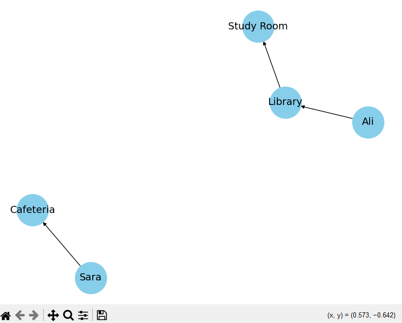
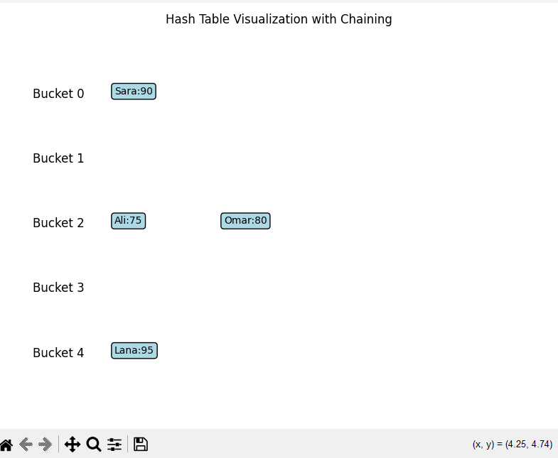

### 📸 Graph Visualization Example

This image shows how students move between campus locations using a directed graph.

- Ali goes to the Library, then the Library leads to the Study Room.
- Sara goes directly to the Cafeteria.
- Each arrow represents a movement direction.

### 📸 Hash Table Visualization

The image below shows how the hash table stores keys using chaining.  
Multiple keys (like "Ali" and "Omar") are stored in the same bucket due to collisions.

